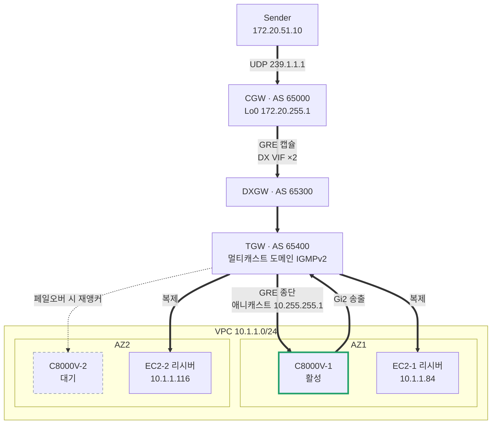
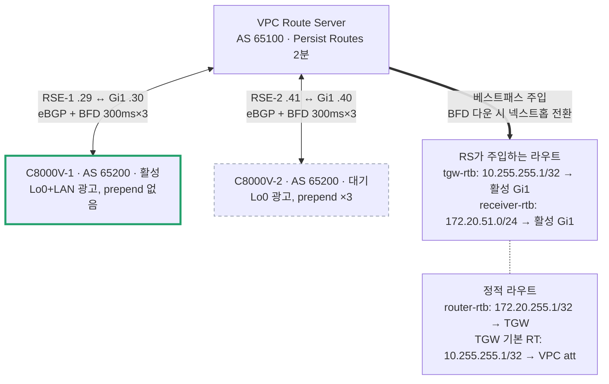

# Lab Topology — 하이브리드 멀티캐스트 HA (실배포 기준)

배포된 mcast-base 스택과 라우터 설정 그대로의 토폴로지입니다.
상세 설명은 [README.md](README.md)를 참고하세요.

## 1. 데이터 경로 — 멀티캐스트 스트림

굵은 화살표가 스트림 경로입니다:
Sender → CGW → (GRE/DX) → 활성 C8000V → Gi2 → TGW 도메인 → 리시버 2대 복제.
점선은 페일오버 시에만 활성화되는 경로입니다.

## 2. 컨트롤 플레인 — Route Server 페일오버

활성 라우터가 죽으면 RS가 BFD로 감지(~1초)해 두 라우트의 넥스트홉을
C8000V-2 Gi1로 바꿉니다. GRE 목적지는 애니캐스트라 CGW는 무변경입니다.

## 3. IP / 서브넷 플랜

| 서브넷 | CIDR | AZ | 배치 |
|---|---|---|---|
| router-sub-az1 | 10.1.1.0/27 | 2a | C8000V-1 Gi1 `.30`, RSE-1 `.29` |
| router-sub-az2 | 10.1.1.32/27 | 2c | C8000V-2 Gi1 `.40`, RSE-2 `.41` |
| receiver-sub-az1 | 10.1.1.64/27 | 2a | C8000V-1 Gi2 `.90`, EC2-1 `.84` — 멀티캐스트 도메인 연결 |
| receiver-sub-az2 | 10.1.1.96/27 | 2c | C8000V-2 Gi2 `.100`, EC2-2 `.116` — 멀티캐스트 도메인 연결 |
| tgw-sub-az1 | 10.1.1.224/28 | 2a | TGW 어태치먼트 ENI + EICE |
| tgw-sub-az2 | 10.1.1.240/28 | 2c | TGW 어태치먼트 ENI |

| 항목 | 값 |
|---|---|
| GRE outer | CGW Lo0 `172.20.255.1` ↔ C8000V 공유 애니캐스트 Lo0 `10.255.255.1` |
| GRE inner (Tunnel100) | CGW `172.16.100.1` ↔ C8000V `172.16.100.2` (두 라우터 공유) |
| ASN | CGW 65000 · RS 65100 · C8000V 65200 · DXGW 65300 · TGW 65400 |
| 온프렘 LAN | 172.20.51.0/24 (Sender 172.20.51.10) |
