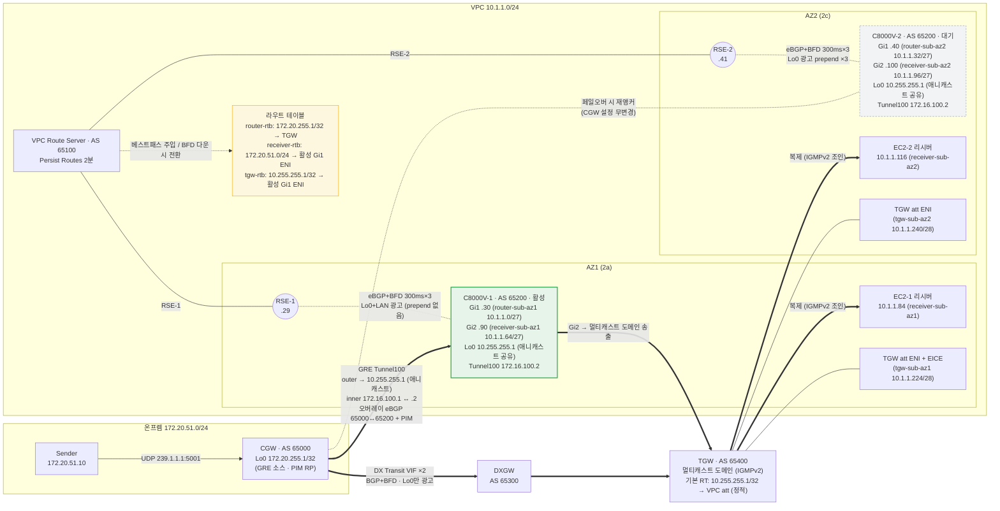

# Lab Topology — 하이브리드 멀티캐스트 HA (실배포 기준)

배포된 mcast-base 스택과 라우터 설정 그대로의 토폴로지입니다.
자세한 설명은 [README.md](README.md)를 참고하세요.

**표기 원칙**

- 굵은 실선 화살표 = 데이터 경로(GRE 언더레이 · 멀티캐스트), 점선 = 컨트롤 플레인(BGP/BFD)과 대기 경로
- 초록 = 활성(C8000V-1, prepend 없음), 회색 점선 테두리 = 대기(C8000V-2, prepend ×3)
- 라우트 테이블 3종의 넥스트홉 "활성 Gi1 ENI"가 Route Server가 BFD 감지로 전환하는 지점
- GRE 터널은 1개 — 목적지가 애니캐스트 Lo0(10.255.255.1)라 페일오버 시 CGW는 아무것도 바꾸지 않음
